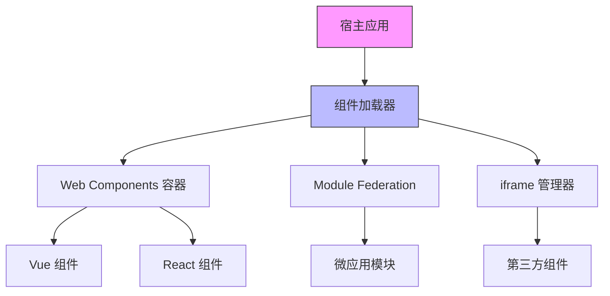

# Web 版 Linux 桌面工具栏动态组件注入方案

## 目录
1. [核心需求](#核心需求)
2. [方案总览](#方案总览)
3. [详细方案](#详细方案)
   - [方案1：Web Components + 自定义元素注册](#方案1web-components--自定义元素注册)
   - [方案2：模块联邦（Module Federation）](#方案2模块联邦module-federation)
   - [方案3：iframe 沙箱隔离](#方案3iframe-沙箱隔离)
   - [方案4：运行时编译（Dynamic Import + Eval）](#方案4运行时编译dynamic-import--eval)
   - [方案5：浏览器插件扩展](#方案5浏览器插件扩展)
   - [方案6：WebAssembly 组件](#方案6webassembly-组件)
4. [方案对比表](#方案对比表)
5. [推荐架构](#推荐架构)

---

## 核心需求
- **框架无关**：支持 Vue/React/Svelte 等任意前端框架
- **动态加载**：运行时按需注入组件
- **样式隔离**：避免组件间样式污染
- **通信机制**：组件与宿主应用的双向通信
- **微前端友好**：适配现有微前端架构

---

## 方案总览
| 方案 | 技术要点 | 隔离性 | 复杂度 |
|------|----------|--------|--------|
| Web Components | Custom Elements + Shadow DOM | ★★★★ | ★★ |
| Module Federation | Webpack 模块共享 | ★★★ | ★★★★ |
| iframe | 原生浏览器沙箱 | ★★★★★ | ★★ |
| 运行时编译 | `new Function()` + Babel | ★★ | ★★★★★ |
| 浏览器插件 | Chrome Extension API | ★★★★ | ★★★ |
| WebAssembly | Rust/C++ 编译为 WASM | ★★★★ | ★★★★★ |

---

## 详细方案

### 方案1：Web Components + 自定义元素注册
#### 实现步骤
```javascript
// 1. 组件包装器（以 Vue 为例）
import { defineCustomElement } from 'vue'
const VueToolbarButton = defineCustomElement({
  template: `<button @click="handleClick">{{text}}</button>`,
  props: ['text'],
  methods: {
    handleClick() {
      this.dispatchEvent(new CustomEvent('tool-click'))
    }
  }
})
customElements.define('vue-tool-button', VueToolbarButton)

// 2. 动态注入
function injectComponent(tagName, props) {
  const el = document.createElement(tagName)
  Object.assign(el, props)
  document.getElementById('toolbar-slot').appendChild(el)
}
```

#### 优点
- 浏览器原生支持
- 天然样式隔离（Shadow DOM）

#### 缺点
- 需要手动处理框架生命周期

---

### 方案2：模块联邦（Module Federation）
#### Webpack 配置
```javascript
// 微应用配置（暴露组件）
new ModuleFederationPlugin({
  name: 'vue_tool_module',
  filename: 'remoteEntry.js',
  exposes: {
    './ToolButton': './src/components/ToolButton.vue'
  }
})

// 宿主应用配置
new ModuleFederationPlugin({
  remotes: {
    vue_tool: 'vue_tool_module@http://cdn.com/vue-app/remoteEntry.js'
  }
})
```

#### 动态加载
```javascript
const { default: VueComponent } = await import('vue_tool/ToolButton')
const app = Vue.createApp(VueComponent)
app.mount('#toolbar-slot')
```

#### 适用场景
- 已有微前端架构的项目
- 需要热更新能力

---

### 方案3：iframe 沙箱隔离
#### 实现示例
```html
<!-- 宿主页面 -->
<div id="toolbar">
  <iframe 
    src="https://your-components.com/vue-button" 
    style="border: none; height: 40px;"
  ></iframe>
</div>
```

#### 通信机制
```javascript
// 子应用发送消息
window.parent.postMessage({
  type: 'TOOLBAR_ACTION',
  payload: { action: 'refresh' }
}, '*')

// 宿主监听
window.addEventListener('message', (event) => {
  if (event.data.type === 'TOOLBAR_ACTION') {
    // 处理动作
  }
})
```

#### 安全建议
- 使用 `sandbox` 属性限制 iframe 权限
- 验证消息来源 `event.origin`

---

### 方案4：运行时编译（Dynamic Import + Eval）
#### 实现代码
```javascript
async function loadVueComponent(url) {
  const code = await fetch(url).then(res => res.text())
  const component = new Function(`
    const { ref } = Vue;
    return {
      template: '<button>动态组件</button>',
      setup() {
        const count = ref(0)
        return { count }
      }
    }
  `)()
  Vue.createApp(component).mount('#toolbar-slot')
}
```

#### 注意事项
- 必须启用 CSP `unsafe-eval`
- 建议配合 Babel 转译

---

### 方案5：浏览器插件扩展
#### manifest.json
```json
{
  "manifest_version": 3,
  "name": "Toolbar Components",
  "content_scripts": [{
    "matches": ["http://your-desktop-app.com/*"],
    "js": ["injector.js"]
  }]
}
```

#### injector.js
```javascript
chrome.runtime.sendMessage({ type: 'INJECT_COMPONENT' }, (response) => {
  const el = document.createElement(response.tagName)
  document.getElementById('toolbar').appendChild(el)
})
```

---

### 方案6：WebAssembly 组件
#### Rust 实现示例
```rust
// lib.rs
#[wasm_bindgen]
pub struct ToolButton {
    text: String,
}

#[wasm_bindgen]
impl ToolButton {
    pub fn new(text: &str) -> Self {
        Self { text: text.into() }
    }
    
    pub fn render(&self) -> JsValue {
        // 返回虚拟 DOM 结构
        json!({
            "tag": "button",
            "children": [self.text]
        }).into()
    }
}
```

#### 前端调用
```javascript
import init, { ToolButton } from './pkg/rust_component.wasm'

async function loadWasm() {
  await init()
  const button = ToolButton.new("WASM 按钮")
  const vdom = button.render()
  renderToDOM(vdom) // 自定义渲染逻辑
}
```

---

## 方案对比表
| 评估维度         | Web Components | Module Fed | iframe | 运行时编译 | WASM |
|------------------|---------------|------------|--------|------------|------|
| **兼容性**       | IE11+         | Webpack 5+ | 全兼容 | 现代浏览器 | 新浏览器 |
| **性能**         | 高            | 中         | 低     | 中         | 极高 |
| **开发体验**     | 中等          | 优秀       | 简单   | 复杂       | 极复杂 |
| **安全性**       | 高            | 中         | 极高   | 低         | 高   |
| **框架支持**     | 所有          | 有限       | 所有   | 所有       | Rust/C++ |

---

## 推荐架构

**实施建议**：
1. 优先使用 Web Components 作为基础方案
2. 复杂微前端场景搭配 Module Federation
3. 对不可信组件使用 iframe 隔离
