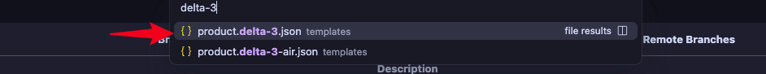

1. template/*.json ➡︎ sections ➡︎ type 的属性值 等于 sections/*.liquid 的文件名，根据这一点就可以搜索找到liquid对应template里的json

2. 就是在引用 snippets/*.liquid，根据这一点就可以搜索找到使用该snippet的section

3. 最简单粗暴的方法：打开开发者工具查看元素的class/id属性值，然后全局搜索定位到html里，进而继续定位一些变量的使用（JS）和样式问题（CSS）

4. 在后台里要充分利用sidekick来找配置页面，直接通过产品名称让sidekick找到对应产品的后台配置页面

5. 浏览器开发者工具中Copy element，将复制的内容对给VSCode中的agent，让它找到对应的代码

6. 根据`Theme Editor`里的`template类型`定位到相关`templates/*`的文件

