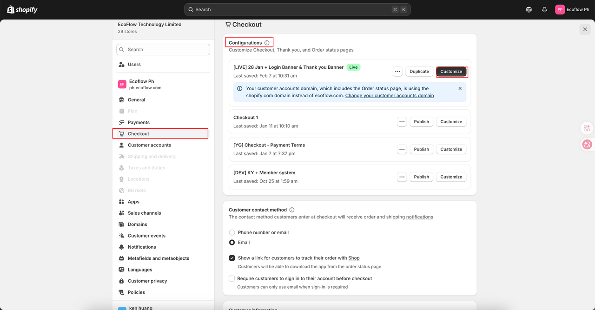
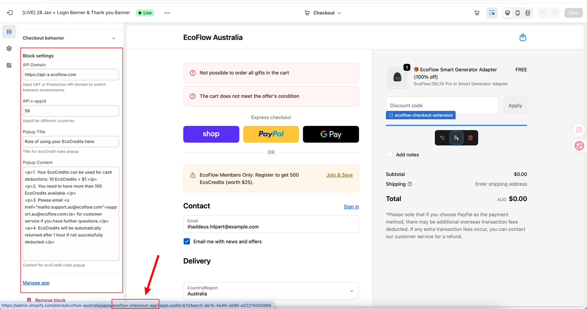
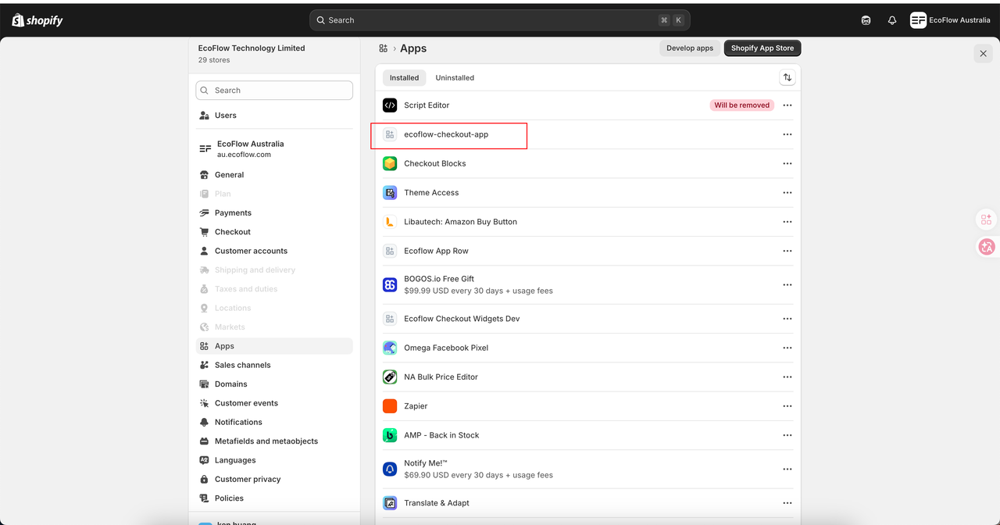

## 标题备选

1. Shopify 开发实战：Shopify 自定义 Checkout 一篇讲清楚
2. 手把手梳理 Shopify：Shopify 自定义 Checkout 的关键用法和避坑点
3. 做 Shopify 项目别只会改主题，这篇带你搞懂 Shopify 自定义 Checkout

## 摘要

这篇文章适合 Shopify 主题和应用开发者，围绕「Shopify 自定义 Checkout」梳理核心概念、配置路径和实战注意点，方便项目中快速对照。

## 正文

哈喽大家好👋 我是程序🦍kk。把复杂知识掰成大白话讲明白，是我一直以来的小追求✨；**打好基础才能稳步进阶**，是我始终秉持的学习理念～

> 📢 我搭建了5000人程序猿专属学习交流群，群内会同步前端开发/全栈开发/Web3开发/远程工作等干货资源，关注我并回复 **加群** ，就能加入交流圈啦🚀

## 前言

**Shopify 项目最容易卡住的地方，往往不是“会不会写代码”，而是主题、应用和后台配置之间的关系没理顺。**

很多同学做 Shopify 开发时，会同时碰到 Liquid、主题目录、Checkout、Metafields、应用后台、性能优化这些概念。单独看不难，放到真实项目里就容易散。

这篇围绕「Shopify 自定义 Checkout」把原始笔记整理成更适合阅读和复用的版本，适合做主题开发、应用开发或者接手 Shopify 项目时快速对照。

## Shopify 实战整理

下面进入 Shopify 相关内容整理。建议大家边看边对照自己的店铺、主题代码和应用后台，很多问题只有放到真实配置里才容易看清楚。

如果你正在做 Shopify 项目，可以重点留意主题代码、后台配置、应用能力和官方限制之间的边界，很多线上问题都出在这些交界处。

## 第一种：Plan为Plus版的店铺可以在后台自定义

## 第二种：通过第三方App来实现自定义

## 其他

通过Checkout Editor反查出checkout的自定义内容是由什么提供的

该图能看到积分信息是由Inscoder开发的ecoflow-checkout-app提供的自定义功能

## 写在最后

好啦，今天的分享就到这里！

💬 互动时间：

你现在做 Shopify 更常遇到的是主题开发、Checkout 定制、应用接入，还是性能优化？如果你在「Shopify 自定义 Checkout」上踩过坑，也可以把场景留言出来。

最后，感谢你看到这里👏

如果喜欢这篇内容，不妨顺手给小编安排一波👇
**点赞**👍｜**转发**📲｜**推荐**❤️｜**评论**📣

要是想第一时间蹲到新内容推送，记得给我点个**星标**⭐️

更多干货内容正在持续填坑中，咱们下期见👋

## 标签建议

Shopify、主题开发、独立站
