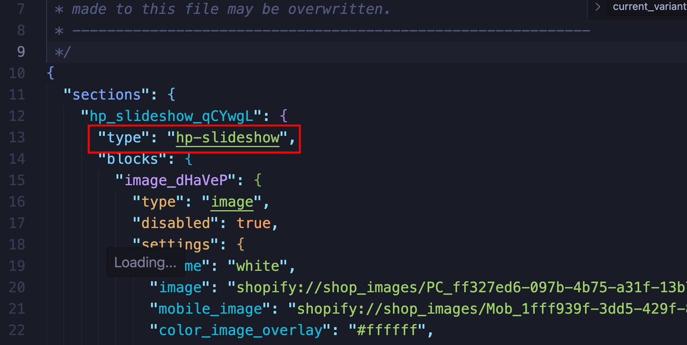
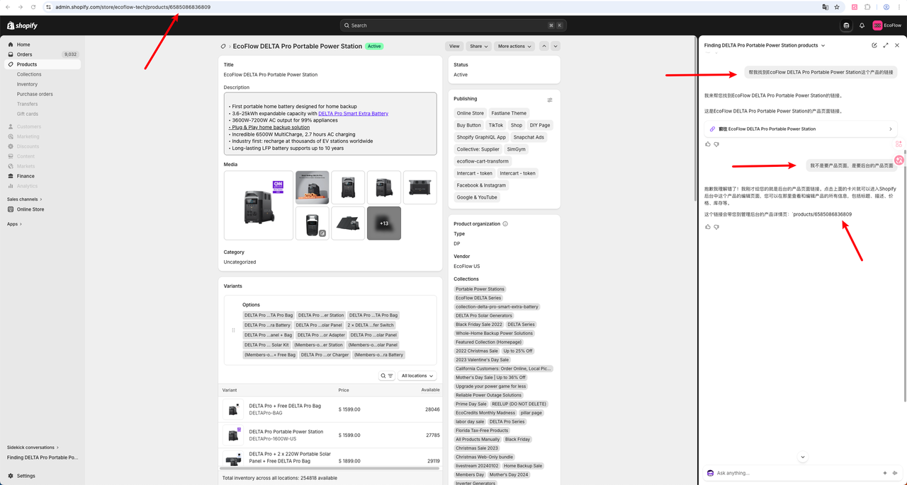
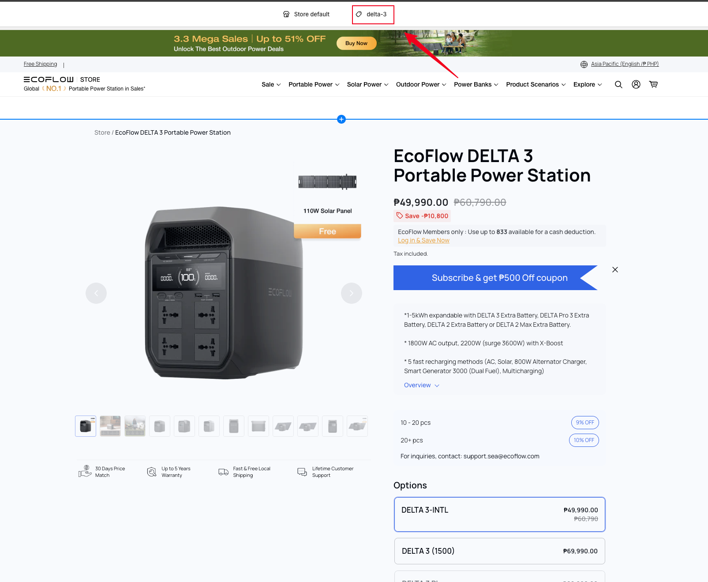
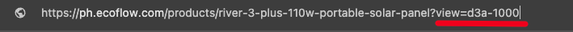

1. template/*.json ➡︎ sections ➡︎ type 的属性值 等于 sections/*.liquid 的文件名，根据这一点就可以搜索找到liquid对应template里的json

2. 就是在引用 snippets/*.liquid，根据这一点就可以搜索找到使用该snippet的section

3. 最简单粗暴的方法：打开开发者工具查看元素的class/id属性值，然后全局搜索定位到html里，进而继续定位一些变量的使用（JS）和样式问题（CSS）

4. 在后台里要充分利用sidekick来找配置页面，直接通过产品名称让sidekick找到对应产品的后台配置页面

5. 浏览器开发者工具中Copy element，将复制的内容对给VSCode中的agent，让它找到对应的代码

6. 根据`Theme Editor`里的`template类型`定位到相关`templates/*`的文件

7. 使用任意产品快速测试某个pdp template的方法

在产品页的URL里设置param: ?view={product-template-id}

这样就省去手动到产品后台修改产品和theme template的关联了

8. 同样，可以使用任意page快速测试某个page template

点击终端的预览链接之后默认进入home page，且url会被重定向到店铺域名

这个时候可以滑动到底部随便进入一个存在且不被hidden的页面，直接用/pages/about这些也可以

然后直接在URL里设置param: ?view={page-template-id}

这样就可以在没有发布代码到live theme里的时候，省去手动到pages后台新建路由和theme template的关联了

9. 发现小技巧：如果product是draft状态，需要使用/products_preview?preview_key=xxxxx来预览，继而添加?view={product-template-id}来测试

10. Liquid 是服务端一次性渲染。初始加载决定文案后，客户端切换变体不会重新执行 Liquid，所以文案一直是第一次渲染时的值。